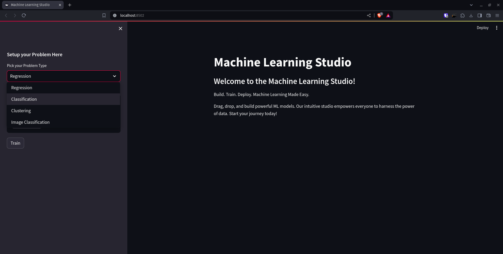
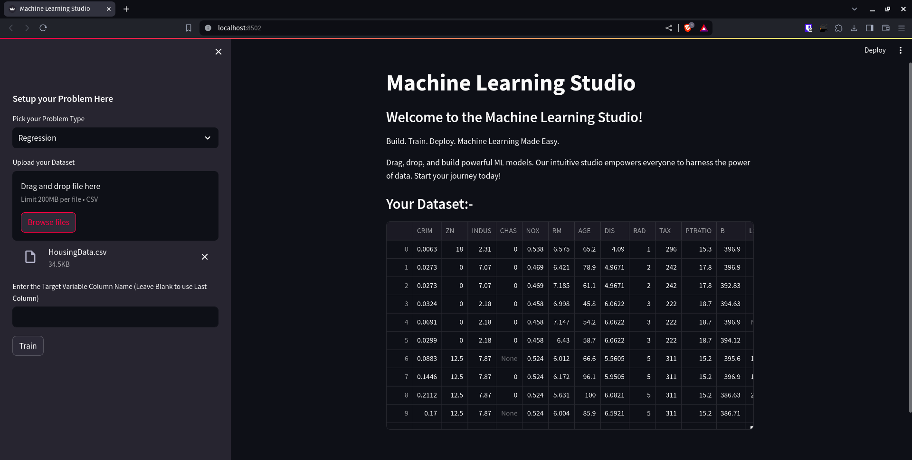
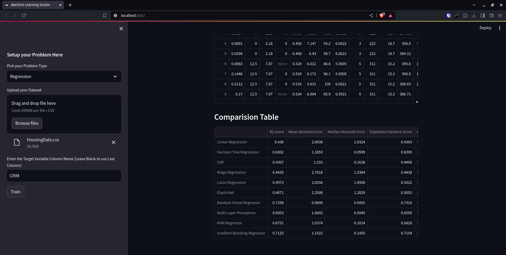
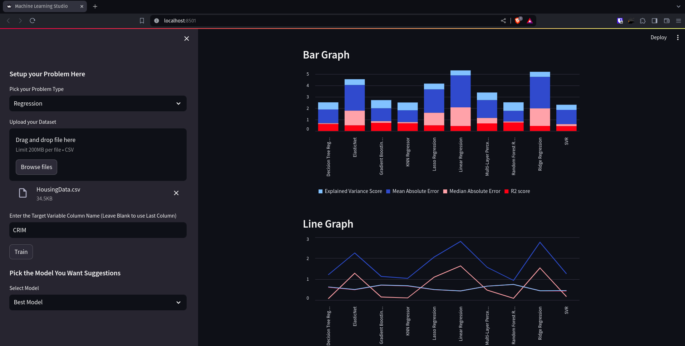
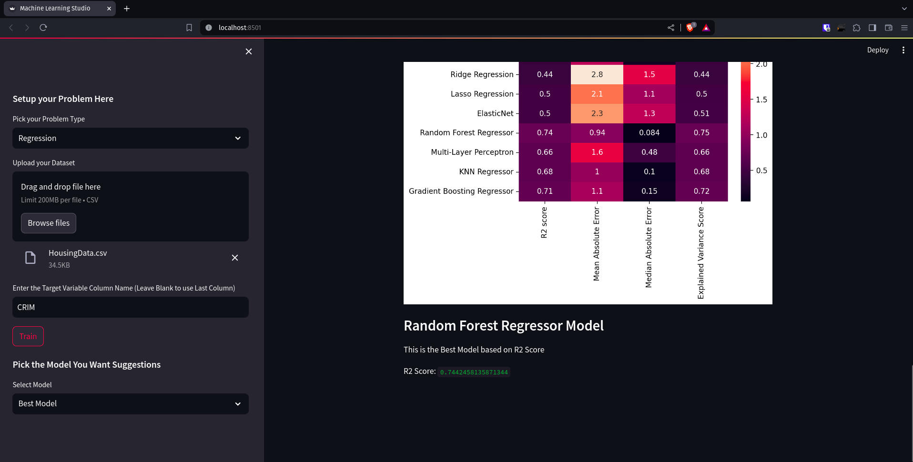
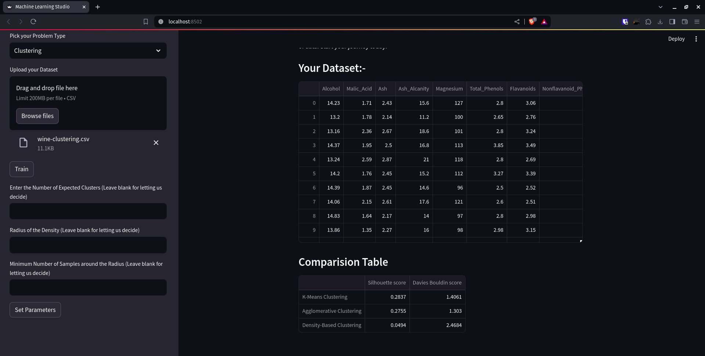

# ML Studio: Your One-Stop Machine Learning Shop

## Overview
ML Studio is a user-friendly web application that empowers you to navigate the world of machine learning, even without extensive coding experience. 

**Key Features:**

1. **Problem Definition:**  Clearly define your goal by choosing the problem type from:
    * Regression: Predict continuous values (e.g.,  price of a house)
    * Classification:  Categorize data points (e.g., spam or not spam email)
    * Clustering:  Group similar data points together (e.g., customer segmentation)
    * Image Classification: Recognize objects within images (e.g.,  identifying cat breeds)

2. **Data Upload:**  Seamlessly upload your dataset in various formats (CSV or ZIP) for analysis.

3. **Hyperparameter Tuning:**  Experiment with key model settings to optimize performance. We provide a user-friendly interface to adjust hyperparameters relevant to your chosen problem type. 

4. **Model Showdown:**  ML Studio takes the reins! It trains and compares different machine learning models suitable for your problem type on your uploaded dataset. 

5. **Champion Model Recommendation:**  Based on the comparison results, ML Studio suggests the model that achieved the best performance on your specific data. This empowers you to make informed decisions about which model to deploy for your project.

**Benefits:**

* **Simplified Machine Learning:**  ML Studio removes the complexity of choosing models and hyperparameters, making it accessible to a broader audience.
* **Data-Driven Decisions:** Get insights into which model best suits your data, leading to more accurate and effective machine learning solutions.
* **Effortless Experimentation:** Easily test and compare different models, saving you valuable time and resources.

**Who is it for?**

* Business Analysts seeking to leverage machine learning for data-driven decision making.
* Developers with limited machine learning expertise who want to incorporate ML models into their applications.
* Anyone curious about exploring machine learning and its potential for their projects.

**Ready to unlock the power of machine learning? Try ML Studio today!**

## How to run this program?

**Step-0: Install all necessary Libraries**

Make sure install recommended modules before running the program

```
pip install -r requirements.txt
```

**Step-1: Running the Web App**

Open your terminal in ML-Studio directory and run the following command
```
streamlit run app.py
```
**Step-2: Select the model of choice**

From the selectbox in the sidebar, pick your desired model



**Step-3: Upload your Dataset**

Upload your Dataset in the widget shown in the sidebar



**Step-4: Selecting the Target Variable (Optional)**

For Regression and Classification problems, you may enter the name of target variable column in the provided dataset, if left empty, we assume the last column as the target variable

**Step-5: Let the model train**

Click Train button once done and let the app do it's magic








**Step-6: Hyperparamter Setting (Optional)**

For Clustering and Image Classification, once Train button is clicked, the model expects values for Hyperparameters, which like Target Variable Section, can be left empty or filled by the user and click Set Parameters to get the result



**Step-7: Page Refresh**

Refresh the page if you wish to train a new model

## Problem Solved: Streamlining Machine Learning Model Selection and Optimization

The ever-growing field of machine learning offers a vast array of models and hyperparameter options. This can be overwhelming, especially for users who are new to machine learning or lack extensive coding experience.  Choosing the right model and tuning its hyperparameters significantly impacts the success of a project.

ML Studio tackles this challenge by providing a user-friendly platform that streamlines the following aspects of machine learning model selection and optimization:

  * **Guided Problem Definition:**  We simplify the initial step by guiding users to select the appropriate problem type (regression, classification, etc.) This ensures they're on the right track from the very beginning.
  * **Effortless Data Handling:**  Uploading data is a breeze with support for various file formats. No need to worry about data wrangling or complex pre-processing steps.
  * **Intuitive Hyperparameter Tuning:**   We offer a user-friendly interface for adjusting hyperparameters relevant to the chosen problem type. Users can experiment with different settings without needing to write code.
  * **Automated Model Comparison:**  ML Studio eliminates the manual process of training and comparing multiple models. It automates this task, saving users valuable time and resources.
  * **Expert Recommendation:**  Instead of sifting through complex metrics, users receive a clear recommendation for the best performing model on their specific data. This empowers them to make informed decisions about model selection.

By addressing these challenges, ML Studio allows users to focus on the real goal: extracting valuable insights from their data. It empowers a wider range of users to leverage the power of machine learning for their projects, even with limited technical expertise.

## Use Cases for ML Studio: Democratizing Machine Learning

ML Studio's user-friendly approach to machine learning opens doors to a variety of use cases across different domains. Here are some examples:

* **Business Analysts:** Identify customer segments for targeted marketing campaigns using clustering or predict sales trends with regression models. They can experiment with different models in ML Studio to find the best fit for their data without needing to write complex code.
* **Citizen Data Scientists:**  Individuals with a basic understanding of data analysis can leverage ML Studio to explore the potential of machine learning for their projects.  They can upload their datasets and get recommendations on models for tasks like predicting stock prices or analyzing customer sentiment in social media data. 
* **Developers (without extensive ML knowledge):**  Integrate machine learning models into web or mobile applications without diving deep into the complexities of model training and optimization.  ML Studio can recommend the optimal model based on their dataset, allowing them to focus on building the application logic.
* **Educators and Students:**  Explore various machine learning concepts in a practical way. Students can upload sample datasets and experiment with different models to understand how they work and how hyperparameters influence performance.


Overall, ML Studio empowers a broader range of users to participate in the machine learning revolution, even if they lack extensive coding experience or deep technical knowledge. It serves as a bridge between data and actionable insights, simplifying model selection and optimization for various data analysis tasks.

## Problems Faced and Solutions Implemented

Developing ML Studio presented several challenges that we actively tackled to ensure a user-friendly and effective platform:

* **Balancing User Interface Complexity with Functionality:**  Simplifying the interface for non-technical users while providing enough control for experienced users was a key concern. We addressed this by offering clear explanations for different options and using intuitive design elements. Additionally, advanced settings can be revealed for users who desire more control.


* **Computational Cost of Automated Model Comparison:**  Training and comparing multiple models can be computationally expensive. We addressed this by optimizing our algorithms and leveraging cloud-based resources for efficient model training. We also offer users the option to choose a subset of models to compare for faster results on smaller datasets.

* **Explainability of Model Recommendations:**  Simply recommending a model might not be enough for users to understand its strengths and weaknesses. We're working on integrating model interpretability techniques to provide users with insights into the model's decision-making process, fostering trust and better understanding.

* **Image Classification Work:**  This is still in development phase so please refrain from using this feature. We regret the inconvenience caused. 

By addressing these challenges, we continuously improve ML Studio, making it a valuable tool for users of all technical backgrounds to navigate the exciting world of machine learning.

## Demonstration

For the demonstration of the usage of this application, please go the following [YouTube Link]()


## Project by Team Runtime Error(VH-251) for Vashisht Hackathon 2024

| Name | Roll Number | Email |
|:-----|:-----------:|:-----:|
|Vishnu Teja Surla | CS21B2037 | cs21b2037@iiitdm.ac.in |
|Sai Kiran Bondi | CS21B2030 | cs21b2030@iiitdm.ac.in |
|Veera Abhiram Palakondu | CS21B2026 | cs21b2026@iiitdm.ac.in |
|M Ashwinth Anbu | CS22B2055 | cs22b2055@iiitdm.ac.in |